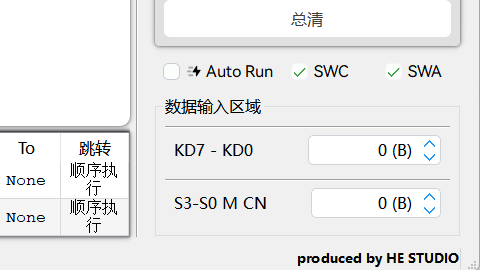
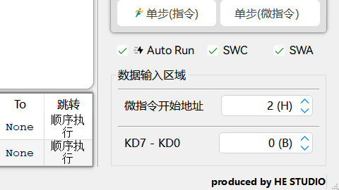
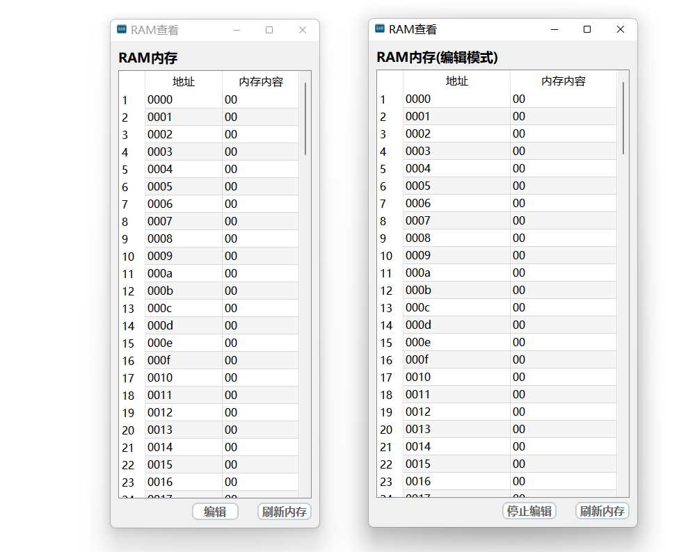
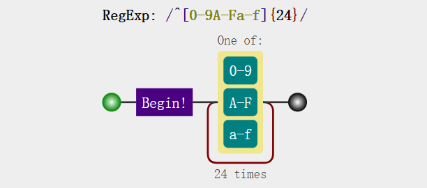
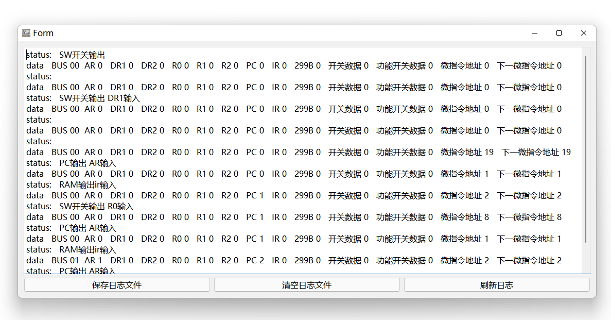
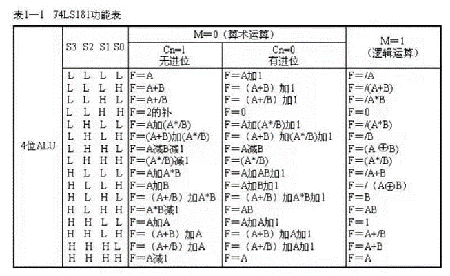

---
html:
    embed_local_images: false
    embed_svg: true
    offline: false

toc:
    depth_from: 1
    depth_to: 3
    ordered: false

export_on_save:
  html: true

print_background: false
---

# CONTENT {ignore=true}

[toc]

<div class="divi_line"></div>

# 一 简介

> 注：该部分内容大约 <i>120</i> 字，阅读该部分大约需要 <i>1</i> 分钟

DVCC simulation environment(以下简称 DVCC)是一款适用于计算机组成原理课程的模拟软件。使用 QT C++构建。相较于其它版本，DVCC 可以脱离硬件设备，独立运行。可以选择读取微代码文件自动运行，也可选择手动配置信号运行。

# 二 DVCC 使用手册

> 注：该部分内容大约 <i>10000</i> 字，阅读该部分大约需要 <i>25</i> 分钟

## 2.1 界面


<div class="note">Fig-2-1 DVCC界面功能划分示意图</div>

-   界面介绍分为以下 6 部分：

1. [菜单栏](#212-菜单栏介绍)
2. [电路图显示区域](#213-电路图区域介绍)
3. [微指令信息显示框](#214-微指令信息区域)
4. [运行状态状态栏](#215-运行状态区域)
5. [快捷按钮&信号控制区域](#216-快捷按钮&信号控制区域)
6. [浮动面板](#217-浮动面板介绍)

### 2.1.1 界面概述

主界面区域划分示意图如 <i>Fig-2-1</i> 所示，界面大致划分为 5 个区域，分别为:菜单栏区域、电路图区域、微指令信息区域、运行状态区域、快捷按钮&信号控制区域。

### 2.1.2 菜单栏介绍


<div class="note">Fig-2-2 菜单栏</div>
菜单栏共有5项，分别为文件、运行、工具、选项、关于菜单栏。

#### 2.1.2.1 文件菜单栏

-   新建一个窗口
    新建窗口独立于原有窗口。

-   打开、保存、另存微代码文件

    -   微代码文件格式为 `.dvc / .txt`
    -   保存可以将目前 RAM、ROM 内内容保存到打开的微代码文件，也可以在未打开文件时，保存到新建文件内。
        (保存文件格式为`.dvc`，注：==非 2 位地址标准的微代码==，而是 DVCC 专用 4 地址微代码)
    -   另存文件。另存默认保存到`txt`格式，同时保存的微代码格式为 2 为地址的标准的微代码。文件名为(`Stander_file_ave_yy-mm-dd_hh-mm-ss.txt`)

-   黏贴微代码
    黏贴的微代码应该为微代码文件内容。

-   打开内存查看器
    内存查看器详细信息见 [2.1.7.1 RAM 面板](#2171-ram面板) && [2.1.7.2 ROM 面板](#2172-rom面板)

#### 2.1.2.2 运行菜单栏

-   选择打开关闭微代码信息框
    微代码信息框见 [2.1.4 微代码信息框](#214-微指令信息区域)

-   配置运行设置
    在版本 <i>1.4.2.2</i> 该菜单项仅能配置指令运行的间隔时间

-   打开运行日志浮动面板
    日志浮动面板见 [2.1.7.3 运行日志](#2173-运行日志)

-   保存运行日志
    保存的文件名格式为`log_save_file_yy-mm-dd_hh-mm-ss.txt`

#### 2.1.2.3 工具菜单栏

-   RAM/ROM 查看器面板
    内存查看器详细信息见 [2.1.7.1 RAM 面板](#2171-ram面板) && [2.1.7.2 ROM 面板](#2172-rom面板)

-   部件选择
    选择加载的部件，未加载的部件在运行过程中所有的操作将被忽略。

-   微指令转换器
    转换器使用说明见 [2.5.2 DVCC 转换器](#252-dvcc转换器)

-   其它面板
    注:==目前未有任何功能==

#### 2.1.2.4 选项菜单栏

-   恢复默认窗口大小
将应用窗口恢复为设置的大小 (推荐大小为 1500x900)
默认窗口大小设置路径为: ```选项菜单栏->设置->通用->默认窗口大小```
-   字体设置
    对目前运行的窗口设置字体 (注：该字体更改不会影响默认设置)
    ==注：请注意，选择的自定字体注意侵权问题，推荐使用"Harmony OS Sans SC"作为字体==
-   主题设置
    对目前运行的窗口设置主题 (注：该主题更改不会影响默认设置)
-   设置
    详细信息见 [2.2 设置使用](#22-设置使用)

#### 2.1.2.5 关于菜单栏

略

### 2.1.3 电路图区域介绍


<div class="note">Fig-2-3 电路图</div>

在电路图区域,各部件的数据位于其中心,需要注意,注入 ALU 等单元仅在输出结果或输入数据时才会显示数据。

各个信号的标注为该信号是否有效，例如`LDDR1: 1`表示为 LDDR1 信号有效。不可简单的将信号有效与微代码为 1 等价。

注意：CN 在有效时表示无进位。
DVCC 信号详细信息见 [2.3 DVCC 信号详解](#23-DVCC信号详解) 。

### 2.1.4 微指令信息区域


<div class="note">Fig-2-4 微指令信息框</div>

微指令信息框内有目前正在执行的微代码以及接下来一条微代码。

在微代码信息框内列的含义依次为：微指令序号、微指令 6 位 16 进制内容、M 信号、CN 信号、WE 信号、B1B0 信号、A 字段内容、B 字段内容、C 字段内容、U5-U0 内容、输出数据到总线的部件、从总线输入数据的部件、跳转方式。

`注`：U5-U0 为微代码所填入的转移地址(序号)，不一定为下一条微指令地址(序号)。

DVCC 信号详细信息见 [2.3 DVCC 信号详解](#23-DVCC信号详解) 。

### 2.1.5 运行状态区域


<div class="note">Fig-2-5 运行状态栏</div>

在该区域显示目前软件运行信息，常见的信息有：

- 微代码文件载入成功提示信息
- 手动信号控制双重输出提示

### 2.1.6 快捷按钮&信号控制区域

#### 2.1.6.1 快捷按钮

<div class="note">Fig-2-6 快捷按钮</div>

- 快捷按钮
快捷按钮与前文菜单栏功能一致，此处不再重复描述。

- 载入预设
通过左侧的下拉框可以选择需要导入的微代码文件，再点击载入按钮即可载入预设，同时需要注意一下几点：
    - 载入预设不会打开微代码文件
    - 载入预设在使用```单步(指令)```按钮时会提示会造成不可预期的错误(在未来版本可能会取消该提醒)。
    - 你也可以载入自己的文件，将你的dvc文件复制到程序目录下的```presetcode```文件夹(具体路径为```./resource/file_resource/presetcode/```)。

- Auto Run
    - ☑ 代表选中自动运行，此时可以通过点击单步(指令)、单步(微指令)读取ROM以及IR等内容自动运行。
    - ▢ 代表未选中，需要手动设置信号，然后点击手动脉冲按钮实现运行。
    &emsp;请注意，DVCC与启动硬件设备所不同之处；DVCC将T4脉冲、T3脉冲合并为手动脉冲，在进行RAM存储实验，T3脉冲选择手动脉冲即可。
    &emsp;(注：在实时刷新下，仅会更新部件，但是不会更新，例如，实时更新下，数据开关数据变化会实时更新到电路图中，但是不会将数据输送到总线，也不会将数据由总线更新到你预期的输入部件)。

- SWC SWA
控制台SWC、SWA开关，☑ 代表有效(高电平)。反之为无效(低电平)。

#### 2.1.6.2 信号控制按钮

<div class="note">Fig-2-7 信号控制按钮</div>

|    按钮    |               含义                |                            备注                            |
| :--------: | :-------------------------------: | :--------------------------------------------------------: |
|    总清    |             PC内容清0             |                             \                              |
|  手动脉冲  |             T3/T4脉冲             |                             \                              |
|    LDAR    |         AR寄存器接入总线          |                             \                              |
| LDAD(LEDB) |   PC计数器接入总线、LED接入总线   |                 PC需要选中也即LDPC信号有效                 |
|   LDDR1    |            DR1接入总线            |                             \                              |
|   LDDR2    |            DR2接入总线            |                             \                              |
|    LDPC    |           PC计数器选中            |                             \                              |
|     CE     |     RAM片选信号，也即RAM有效      |                             \                              |
|     WE     |        有效WRITE，无效READ        |                             \                              |
|     AR     | ALU带进位运算，运算结果影响ZI、CY |                             \                              |
|    SWB     |       数据开关数据送入总线        |                             \                              |
|    ALUB    |        ALU运算结果送入总线        | ALUB是ALU运算开启的前提，也即仅在ALUB信号有效时ALU进行运算 |
|    PCB     |         PC计数器送入总线          |                 PC需要选中也即LDPC信号有效                 |
|    299B    |         299B接入/送入总线         |                         类似于ALUB                         |

#### 2.1.6.3 数据输入区域
<div class="img_con">
    
    
</div>
<div class="note">Fig-2-7 数据输入区域</div>

数据输入区域分为两种情况：
- 自动运行( *Fig-2-7 右图* )
    - 微指令开始地址
    每一条指令的预设开始地址。
    - KD7-KD0
    数据开关。

- 手动运行( *Fig-2-7 左图* )
    - KD7-KD0
    数据开关。
    -S3-S0 M CN
    ALU的功能开关。(详情见 [2.3.2 ALU功能表](#ALU功能表) )

### 2.1.7 浮动面板介绍

<div class="note">Fig-2-8 Ram Rom 内存面板(非编辑态)</div>

#### 2.1.7.1 RAM 面板

<div class="note">Fig-2-9 RAM面板</div>

- RAM面板基本构成
    - 左上标题可以显示出目前处于的状态，在编辑模式总，可以通过双击RAM内存内容单元格，更改对应的RAM内存的内容。
    - ```编辑```按钮，通过点击编辑按钮可以更改RAM面板的状态(查看/编辑)。
    - ```刷新内存```按钮：可以通过点击该按钮来刷新面板的数据。目前测试中可以实现自动刷新。

- 编辑过程
    - 如果处于编辑模式，你可以直接双击单元格编辑内容。
    - 如果未处于编辑模式，你可以通过编辑按钮进入编辑模式，再双击单元格编辑。
- 输入的格式为 *Fig-2-10* 所示的正则式，请注意此处以8Bits环境为例。

<div class="note">Fig-2-10 RAM内容正确格式(8Bits为例)</div>

#### 2.1.7.2 ROM 面板


<div class="note">Fig-2-11 ROM面板</div>

- ROM面板基本构成
    - 左上标题可以显示出目前处于的状态，在编辑模式总，可以通过双击RAM内存内容单元格，更改对应的ROM内存的内容。
    - ```编辑```按钮，通过点击编辑按钮可以更改ROM面板的状态(查看/编辑)。
    - ```刷新内存```按钮：可以通过点击该按钮来刷新面板的数据。目前测试中可以实现自动刷新。

- 编辑过程
    - 如果处于编辑模式，你可以直接双击单元格编辑内容。
    - 如果未处于编辑模式，你可以通过编辑按钮进入编辑模式，再双击单元格编辑。
- 输入的格式为 *Fig-2-11* 所示的正则式，请注意，请勿对非内容列进行编辑。

<div class="note">Fig-2-11 ROM内容正确格式</div>

- ==24位微代码格式==
原来16进制对应位顺序为: 654321(对应功能位顺序为：S3-S0···U5-U0)在文件中顺序为: 563412。

#### 2.1.7.3 运行日志

<div class="note">Fig-2-11 运行日志</div>

如图 *Fig-2-11* 所示，你可以在该面板进行保存，查看日志等操作。

## 2.2 设置使用

设置大致分为 4 部分：

1. [通用设置](#221-通用设置)
2. [运行设置](#222-运行设置)
3. [高级设置](#223-高级设置)
4. [其它设置](#224-其它设置)

### 2.2.1 通用设置

通用设置可以设置语言、主题、字体族、字体大小、窗口默认大小。

- 目前支持 2 种主题(macQss、orignal)，你可以选择自主制作主题，让后将主题 qss 文件放置于程序文件夹下的```theme```文件夹(具体路径: ```./resource/file_resource/theme/``` )。

- 字体族推荐 "Harmony OS Sans Sc",字体大下推荐 12 号字。

- 默认推荐窗口大小 **1400x800**

- ==注==：
    - 目前语言仅支持中文，英文翻译暂未推送。
    - 设置均在下一次打开应用时生效。

### 2.2.2 运行设置

-   调整默认起始微地址微指令序号：选择运行设置中的**起始微地址**设置项，将其设置为你所想要的起始地址，点击保存，即可调整默认起始微地址。

-   通过设置**指令运行间隔时间**滑动条，你可以调整指令运行时，每一条微指令的间隔时间。(推荐间隔时间为：1000ms)

-   实时刷新
激活实时刷新后，你的任何操作，将会被立即更新到电路图区域。
    > ==注==：激活实时刷新对电脑资源占用量较大，请谨慎开启。
    > <div class="note">Fig-2-12 实时刷新关闭</div>
    > <div class="note">Fig-2-13 实时刷新开启</div>

### 2.2.3 高级设置

> 该区域设置请谨慎调整。

-   你可以通过该区域的 ram，rom 行数调整 DVCC 的 ram、rom 长度，最大支持**FFFF**(H)行。在设置时，请注意你的行数不应该小于你所导入的微代码文件的最大地址。(你可以通过查看导入成功显示的消息框，确定是否含有超出地址范围的 RAM、ROM 内容)

-   (未开启)你可以通过设置环境 Bit 数目来调整 DVCC 的 RAM 的长度，同时设置总体总线的长度(最大 bit 数 16Bits)

-   (预期添加设置)可以通过设置，选择更换自动运行状态时是否清除内存内容。

-   打开设计器，通过选中该设置项，你可以使用 DVCC 设置器，在打开时会提示输入密钥(密钥的长度为 16 位数字，在输入时请不要输入任何非数字的字符，同时请注意选择关闭设计器后，再次开启需要再次提供密钥)，你可以向老师申请提供密钥(如果你是老师，您可以发送邮件到 haley_ehrich@outlook.com 获取密钥)。

### 2.2.4 其它设置

-   在该设置界面，你可以检查是否有软件更新，也可以将所有设置项全部恢复为默认设置

## 2.3 DVCC 信号详解

### 2.3.1 24位微程序含义

<div class="note">Tab-2-1 ALU功能表</div>

| S3-S0 | M | CN | WE | B1 B0 | A | B | C | U5-U0 |
| :-: | :-: | :-: |:-:| :-: | :-: | :-: | :-: | :-: |
|24 23 22 21  | 20 | 19 | 18 | 17 16 | 15 14 13 | 12 11 10 | 9 8 7 | 6 5 4 3 2 1 |
| ALU功能选择 | ALU功能选择 | ALU功能选择 | 读写信号 | 外部设备接入 | 输入部件选择 | 输出部件选择 | 跳转方式、进位运算 | 下一微地址 |

### 2.3.2 ALU功能表

<div class="note">Fig-2-14 ALU功能表</div>

### 2.3.3 B1 B0

<div class="note">Tab-2-2 B1B0功能表</div>

| B1 B0 | 功能描述      |
| :-: | :-: |
| 00    | 选中开关输入  |
| 01    | 选中RAM      |
| 10    | 选中LED输出   |
| 11    | NONE         |

### 2.3.4 A字段功能表
<div class="note">Tab-2-3 A字段功能表</div>

| A3 A2 A1 | 功能描述 | 备注              |
| :-: | :-: | :-: |
| 000      | NONE     | <br />           |
| 001      | LDRi     | 选择同指令寄存器(IR)的最低2位(I1，I0)配合。<br />I1，I0=00时为输入到R0寄存器；<br />I1，I0=01时为R1；<br />I1，I0=10时为R2。 |
| 010      | LDDR1    | DR1选中          |
| 011      | LDDR2    | DR2选中          |
| 100      | LDIR     | IR选中           |
| 101      | LDAD     | PC计数器选中 ( 选中PC计数器==也即LDPC有效== ) |
| 110      | LDAR     | 地址寄存器选中    |
| 111      | NONE     | <br />  |


### 2.3.5 B字段功能表
<div class="note">Tab-2-4 B字段功能表</div>

| B3 B2 B1 | 功能描述 | 备注 |
| :-: | :-: | :-: |
| 000      | NONE     | &emsp; &emsp; &emsp; &emsp; &emsp; &emsp; &emsp; &emsp; &emsp;<br />                        |
| 001      | RS-B     | I3，I2=00时为R0<br />I3，I2=01时为R1<br />I3，I2=10时为R2 |
| 010      | RD-B     | I1，I0=00时为R0<br />I1，I0=01时为R1<br />I1，I0=10时为R2 |
| 011      | RI-B     | 变址寄存器选中，默认R2寄存器 |
| 100      | 299-B    | 299选中输出          |
| 101      | ALU-B    | ALU选中输出          |
| 110      | PC-B     | PC选中输出 ( 选中PC计数器==也即LDPC有效== ) |
| 111      | NONE     | <br />              |

### 2.3.6 C字段功能表
<div class="note">Tab-2-5 C字段功能表</div>

| C3 C2 C1 | 功能描述 | 备注      |
| :-: | :-: | :-: |
| 000      | NONE     | <br /> |
| 001      | P(1)     | 如果U3为0：IR7-IR4作为测试条件。IR7-IR4替换下一顺序微地址的U3-U0。<br />如果U3为1：IR6-IR4作为测试条件，IR6-IR4替换下一顺序微地址的U2-U0。<br />​<br /> |
| 010      | P(2)     | IR3-IR2作为测试条件。IR3-IR2替换下一顺序微地址的U1-U0。      |
| 011      | P(3)     | ZI/CY为true，下一顺序微地址的第U4位变1                       |
| 100      | P(4)     | SWC，SWA作为测试条件，使用SWC、SWA替换下一顺序微地址的U1、U0。 |
| 101      | AR       | ALU带进位运算，运算结果影响CY/ZI。                           |
| 110      | LDPC     | ==选中PC计数器==，只有PC计数器选中后，PC计数器才可以输入、输出。<br />注意：在PC计数器输出后，PC内容加1。 |
| 111      | NONE     | <br />         |

## 2.4 微代码文件
### 2.4.1 .dvc微代码文件
dvc文件为软件专用微代码文件，地址长度由原来的2位地址增长为4位地址。其支持的格式如下图所示。
</img>
<div class="note">Fig-2-15 ram dvc 文件格式</div>

</img>
<div class="note">Fig-2-16 rom dvc 文件格式</div>

**```注```**: \uFF04 为：```＄``` 字符，请注意与 ```$``` 区别。

### 2.4.2  .txt微代码文件
- 启东产品使用txt作为其微代码文件。其使用```＄```(\uFF04) 作为其起始字符，请注意使用```$```作为每一行微代码的起始字符可能会无法使用于启东联机软件。

</img>
<div class="note">Fig-2-17 ram txt 文件格式</div>

</img>
<div class="note">Fig-2-18 rom txt 文件格式</div>

- 可以使用```另存```菜单项将dvc文件保存为标准微代码txt文件，详见 [2.1.2.1 文件菜单栏](#2121-文件菜单栏) 。也可使用提供的DVCC转码器转为标准代码，详见 [2.1.2.3 工具菜单栏](#2123工具菜单栏) 。

<div class="divi_line"></div>

# 三 项目信息文件

## 3.1 开源协议
- Apache License 2.0
> A permissive license whose main conditions require preservation of copyright and license notices. Contributors provide an express grant of patent rights. Licensed works, modifications, and larger works may be distributed under different terms and without source code.

## 3.2 Github 仓库说明
> DvccSimulationEnvironment
├─ LICENSE
├─ README.md
├─ handbook
├─ resource
│&emsp;&emsp;├─ file_resource
│&emsp;&emsp;└─ imagine_res
└─ source code
&emsp;&emsp;├─ dvcc
&emsp;&emsp;├─ dvcc designer
&emsp;&emsp;└─ dvcc format converter

- handbook：使用手册文件夹
- resource：文件资源文件夹
- source code：
    - dvcc：dvcc源码
    - dvcc desinger：dvcc设计器源码
    - dvcc format converter： dvcc微代码转码器源码

## 3.3 二次开发相关信息
### 3.3.1 项目文件信息

> DVCC
├─ DVCC.pro
├─ DVCC.pro.user
├─ DVCC_zh_CN.qm
├─ DVCC_zh_CN.ts
├─ configset.cpp
├─ configset.h
├─ functionset.cpp
├─ functionset.h
├─ logo.ico
├─ main.cpp
├─ mainwindow.cpp
├─ mainwindow.h
├─ mainwindow.ui
├─ paint
│    ├─ aluqgitem.cpp
│    ├─ aluqgitem.h
│    ├─ arqgitem.cpp
│    ├─ arqgitem.h
│    ├─ cirgraphicsview.cpp
│    ├─ cirgraphicsview.h
│    ├─ dr1qgitem.cpp
│    ├─ dr1qgitem.h
│    ├─ dr2qgitem.cpp
│    ├─ dr2qgitem.h
│    ├─ inputqgitem.cpp
│    ├─ inputqgitem.h
│    ├─ irqgitem.cpp
│    ├─ irqgitem.h
│    ├─ microconqgitem.cpp
│    ├─ microconqgitem.h
│    ├─ outputqgitem.cpp
│    ├─ outputqgitem.h
│    ├─ pcqgitem.cpp
│    ├─ pcqgitem.h
│    ├─ r0qgitem.cpp
│    ├─ r0qgitem.h
│    ├─ r1qgitem.cpp
│    ├─ r1qgitem.h
│    ├─ r2qgitem.cpp
│    ├─ r2qgitem.h
│    ├─ ramqgitem.cpp
│    ├─ ramqgitem.h
│    ├─ shifter299qgitem.cpp
│    ├─ shifter299qgitem.h
│    ├─ signalsqgitem.cpp
│    └─ signalsqgitem.h
├─ resource
│    ├─ file_resource
│    │    ├─ configuration.ini
│    │    ├─ font
│    │    ├─ presetcode
│    │    └─ theme
│    └─ imagine_res
│           ├─ con_img
│           ├─ icon
│           ├─ img
│           ├─ menubar
│           └─ window_img
├─ systemdataset.cpp
├─ systemdataset.h
├─ toolpannel
│    ├─ componentsettingpannel.cpp
│    ├─ componentsettingpannel.h
│    ├─ componentsettingpannel.ui
│    ├─ logpannel.cpp
│    ├─ logpannel.h
│    ├─ logpannel.ui
│    ├─ ramcheck.cpp
│    ├─ ramcheck.h
│    ├─ ramcheck.ui
│    ├─ romcheck.cpp
│    ├─ romcheck.h
│    ├─ romcheck.ui
│    ├─ settingpannel.cpp
│    ├─ settingpannel.h
│    └─ settingpannel.ui
├─ versioninfo.cpp
└─ versioninfo.h

- 浮动面板均处于 tool pannel文件夹内
- 电路图部件绘制处于paint文件夹内，重载QGraphicsItem。
- 各部件逻辑实现处于```fuctionset.cpp```
- 数据存储，以及信号使用变量位于```systemdatset.cpp```
- 配置文件管理位于```configset.cpp```
- 版本信息管理位于```versioninfo.cpp```

### 3.3.2 二次开发建议
- 在开发新部件时请注意部件在重绘时所需要占用的资源，推荐仍使用目前使用的QGraphics架构进行绘图操作。
- 在新建部件逻辑处理函数时，推荐使用独立的函数，每次传入数据指针，内部使用指针完成数据传递，而非绑定数据，这样便于后期做出界面更改时而不需要对逻辑函数进行大范围修改。

<div class="divi_line"></div>

# 四 Q&A
**Q: DVCC与启东系列实验设备是否具有区别?**
&emsp;*A: DVCC在基本结构上与启东的保持一致，区别在于部分信号由低电平有效变为高电平有效，但在DVCC内 **高电平** 一般都代表为有效，而非电平的高低，此处也是为了能够区别于在数字逻辑等课程中的高低电平问题，个人认为计算机组成原理课程更应该关注于整个计算机基本构成，以及计算机是如何实现运行而非纠结于电平高低问题。*

**Q: 设计器密钥如何获取？**
&emsp;*A: 你可以向你的任课教师申请获取该密钥。*

**Q:是否可以二次开发商用？**
&emsp;*A: 可以二次开发商用，具体细节请查阅项目开源协议。*


<style>
@font-face {
    font-family: "EDIX";
    src: url(../resource/font/EDIX.ttf);
}
@font-face {
    font-family: "EDMorganite-BookIX";
    src: url(../resource/font/Morganite-Book.ttf);
}

@font-face {
    font-family: "HarmonyOS_Sans_Regular";
    src: url(../resource/font/HarmonyOS_Sans_Naskh_Arabic_Regular.ttf);
}

/* Main body css set */
html {
    background-color: white;
}

/* Header css set：Header contained website name slogan scroll tip*/
header {
    background-color: #7cffcb;
    background-image: linear-gradient(315deg, #7cffcb 0%, #74f2ce 74%);

    margin: 0px;
    
    padding: 0px;
}

.page_header_con{
    align-items: center;

    background-color: #7cffcb;
    background-image: linear-gradient(315deg, #155996 0%, #158b64 74%);
    
    display: flex;
    
    flex-direction: column;
    font-family: "Open Sans", "Helvetica Neue", Helvetica, Arial, sans-serif;
    
    justify-content: center;
    
    height: 45vh;
    
    position: relative; 
    
    width: 100%;
}

.page_header_main_title{
    color: #ffffff;

    font-size: 40px;
    font-weight: bold;
    
    margin: 0px;
}

.page_header_sub_title{
    color: rgba(255,255,255,0.7);

    font-size: 18px;
    
    margin: 0px;
    margin-top: 10px;
}

.page_header_btn_con{
    display: flex;
    
    flex-direction: row;
    
    justify-content: center;
    
    margin-top: 20px;
}

.page_header_btn{
    color: rgba(255,255,255,0.7);

    background-color: rgba(255,255,255,0.08);
    border-color: rgba(255,255,255,0.2);
    border-style: solid;
    border-width: 1px;
    border-radius: 0.3rem;
    
    display: inline-block;
    
    font-size: 15px;
    font-weight: bold;
    
    margin-top: 10px;
    margin-left: 5px;
    margin-right: 5px;
    
    padding-top: 10px;
    padding-bottom: 10px;
    
    text-align: center;
    text-decoration: none;
    transition: color 0.2s, background-color 0.2s, border-color 0.2s;
    
    width: 150px;
}

.page_header_btn:hover{
    cursor: pointer;
    background-color: rgba(255, 255, 255, 0.4);
}

/* Body css set */
body{
    font-family: "Open Sans", "HarmonyOS_Sans_Regular", Helvetica, Arial, sans-serif;
    margin: 0px 0px;
}

/* Passage nav css set */
.art_nav_con{
    display: flex;

    flex-direction: column;
    
    justify-content: center;
    
    width: 100%;
    
    /* background-color: red; */
}

.art_nav_title{
    font-family: inherit;
    font-size:35px;
    font-weight: bold;

    margin: 0px;
    
    padding-top: 10px;
    padding-left: 20px;
    /* background-color: lavender; */
}

.art_nav_con ul{
    margin: 0px;

    padding-top: 10px;
    padding-bottom: 10px;
    padding-right: 0px;
    padding-left: 0px;
    /* background-color: khaki; */
}

.art_nav_con ul li{
    list-style: none;
    margin-left: 0px;
}

.nav_link_item{
    color: black;

    font-family: inherit;
    font-size: 20px;
    padding-left: 5%;
    
    text-decoration: none;
}

.nav_link_item_1{
    color: black;
    font-family: inherit;
    font-size: 20px;
    padding-left: 5%;
    text-decoration: none;
}

.nav_link_item_2{
    color: black;

    font-family: inherit;
    font-size: 20px;
    
    padding-left: 7%;
    
    text-decoration: none;
}

.nav_link_item_3{
    color: black;

    font-family: inherit;
    font-size: 20px;
    
    padding-left: 10%;
    
    text-decoration: none;
}

.nav_link_item:hover, .nav_link_item:visited,.nav_link_item_1:hover, .nav_link_item_1:visited,.nav_link_item_2:hover, .nav_link_item_2:visited,.nav_link_item_3:hover, .nav_link_item_3:visited{
    color: rgba(0, 0, 0, 0.7);
    text-decoration: underline rgba(0, 0, 0, 0.7) 2px;
}

/* Passage container css set */
.article_con{
    font-family: inherit;
}

.divi_line{
    border-bottom: #dfdedcb4 solid 2px;
    line-height: 2px;
    width: 80%;
    margin-left: 10%;
}

.h1{
    color:rgba(0, 0, 0, 1.0);

    font-family: inherit;
    font-size: 35px;
    font-weight: bold;
    
    margin: 0px;
    margin-left: 2%;
    margin-top: 10px;
}

.h2{
    color:rgba(0, 0, 0, 0.7);
    
    font-family: inherit;
    font-size: 20px;
    font-weight: bold;
    
    margin: 0px;
    margin-left: 2%;
    margin-top: 5px;
}

.h3{
    color:rgba(0, 0, 0, 0.5);
    
    font-family: inherit;
    font-size: 20px;
    font-weight: normal;
    
    margin: 0px;
    margin-left: 2%;
    margin-top: 5px;
}

.quote{

    background-color: #fafbfc;
    border-left: #e8e8e6 solid 5px;
    
    color:rgba(0, 0, 0, 1.0);
    
    font-family: inherit;
    font-size: 20px;
    font-weight: normal;
    
    margin: 0px;
    margin-left: 5%;
    
    padding: 5px 5px;
    
    width: 100%;
}

.link{
    color: #4169e1;

    font-style: italic;
    
    margin: 0px;
    margin-left: 5%;
    
    text-decoration: none;
}

.note{
    font-family: inherit;
    font-size: 8px;
    font-weight: lighter;
    font-style: italic;

    margin: 0px;
    
    text-align: center;
    
    width: 100%;
}

.para, .article_con p{
    font-family: inherit;
    font-size: 20px;

    margin-top: 2%;
    
    margin: 0px;
    margin-left: 5%;
    
    text-indent: 20px;
}

.para::first-letter{
    font-size: 35px;
    font-weight: bold;

    text-transform: Capitalize;
}

.img_con{
    align-items: center;
    border-radius: 5px;
    display: flex;
    flex-direction: row;
    justify-content: center;
    margin-bottom: 10px;
    margin-left: 5%;
    padding: 0px 0px;
    width: 90%;
}

.img_con .img{
    border-radius: 5px;
    margin-top: 5px;
    margin-bottom: 5px;
    margin-left: 5px;
    margin-right: 5px;
    width: 45%;
    object-fit:cover;
    justify-content: center;
}

.img{
    border-radius: 5px;
    margin-top: 5px;
    margin-bottom: 5px;
    margin-left: 5px;
    margin-right: 5px;
    width: 95%;
    object-fit:cover;
    justify-content: center;
}

/* Footer css set */
footer {
    background-color: #f7f7f7;
    height: auto;
    text-align: center;
    text-decoration: none;
}

footer a {
    color: black;
    font-family: "HarmonyOS Sans Regular", sans-serif, serif;
    font-size: 10px;
    text-decoration: none;
}

footer a:hover{
    color: rgba(0, 0, 0, 0.5);
    text-decoration: underline rgba(0, 0, 0, 0.5) 2px;
}

</style>
